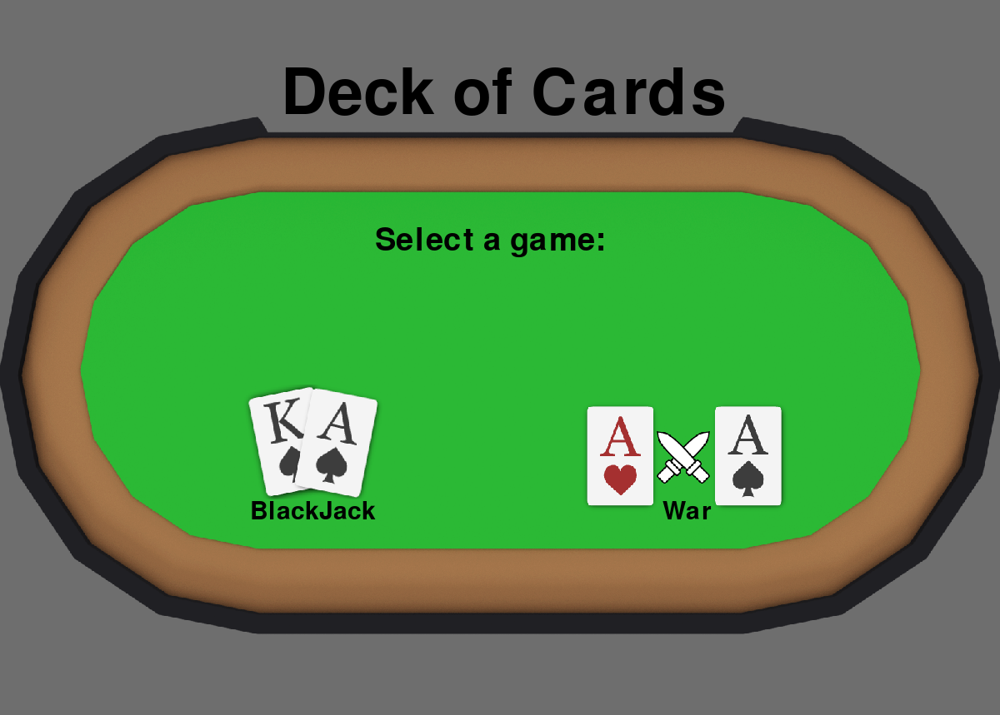
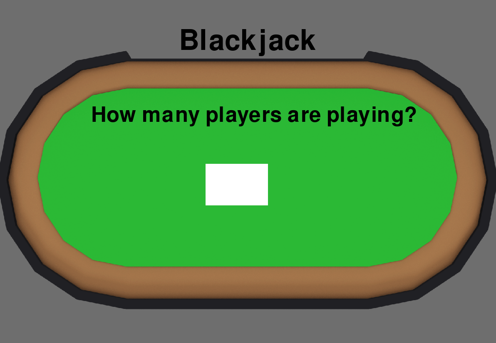
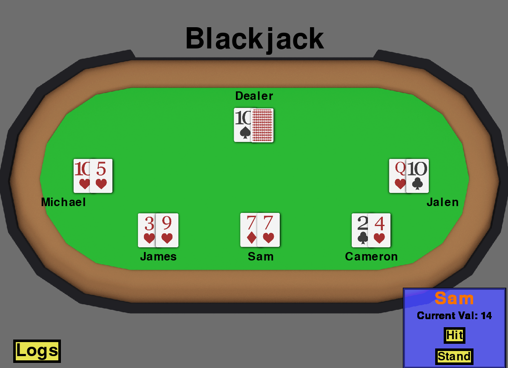
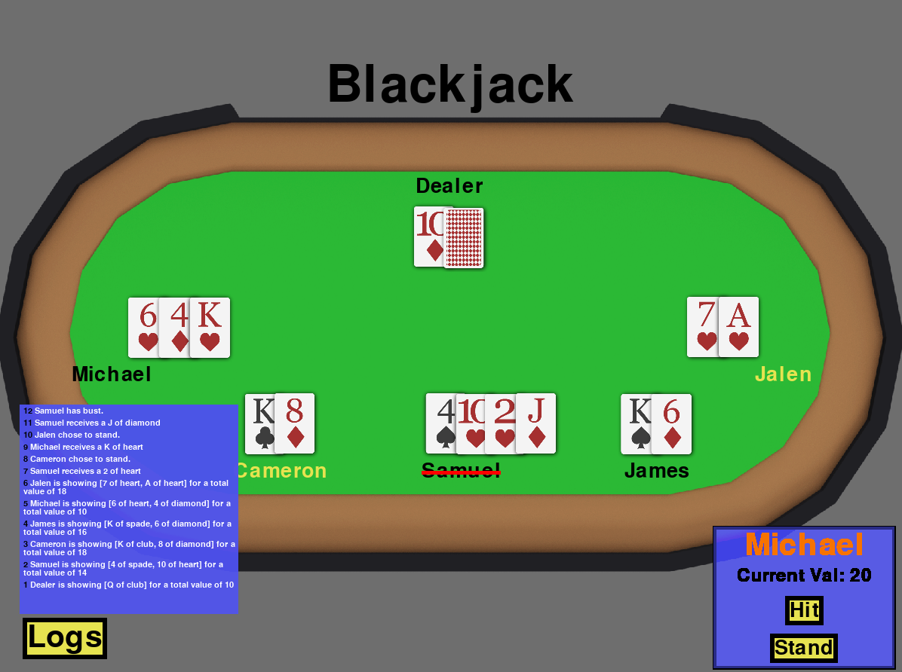
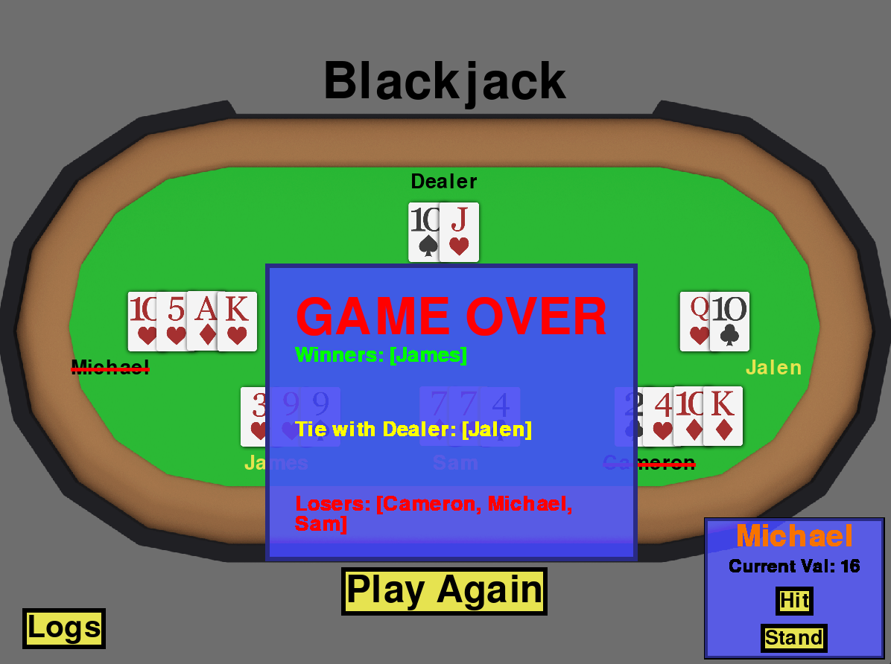
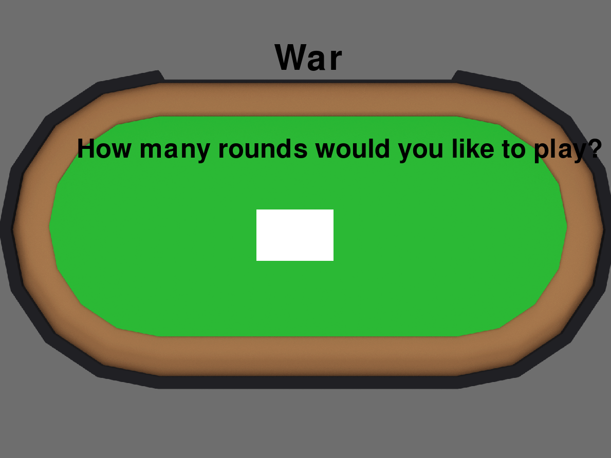
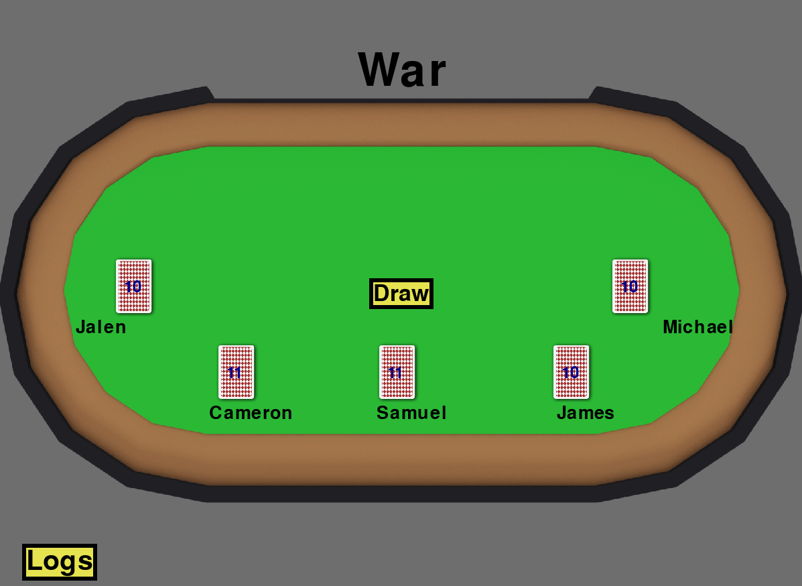
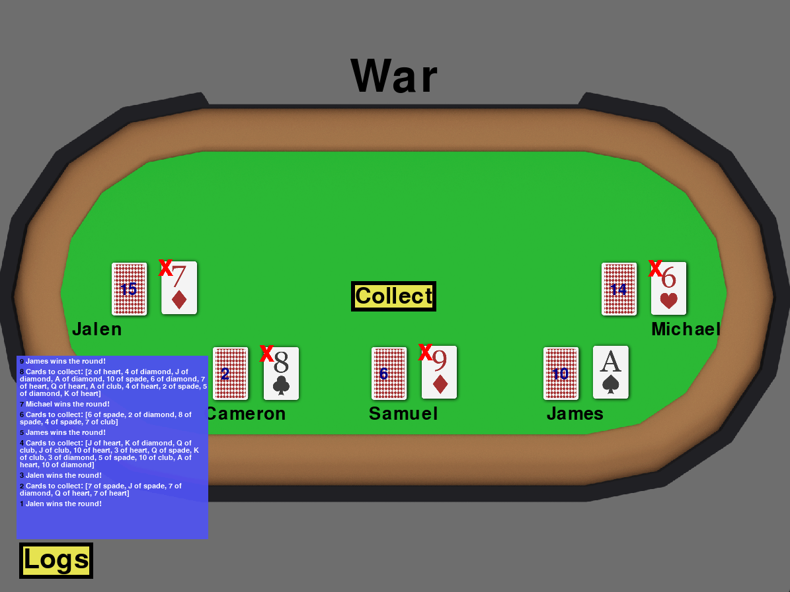

# Deck-of-Cards
A set of classes that represent a deck of poker-style playing cards. (Fifty-two playing cards in four suits: hearts, spades, clubs, diamonds, with face values of Ace, 2-10, Jack, Queen, and King.)

I created two classes to represent my deck, a `Card` class and a `Deck` Class.

The **`Card`** class has class variables: 
- `value` stores the value of the card: [A, 2, 3...Q, K]
- `suit` stores the suit of the card [Spade, clubs, hearts, diamond]
- `suit_weight` stores the weight value of the suit [1,2,3,4]


The **`Deck`** class has class variables:
- `suits` holds a list of suit tuples [("diamonds",1), ("clubs",3), ("hearts",2), ("spades",4)]
- `count` a count of the current number of cards in the deck
- `deck` a list of cards (objects) in the deck

Within the deck class I provide the following operations:
1. **shuffle()** 
    Shuffle returns no value, but results in the cards in the deck being randomly permuted. Shuffle is called in the intialization of the deck class.

2. **deal_card()**
    This function returns one card from the deck to the caller and removes the card from the deck.

3. **sort_deck()**
    This function will utilize merge sort to sort the cards in ascending order by suits and value such that:
```
(A of spades, A of clubs, A of hearts, A of diamonds ... K of Diamonds)
```

## Games

Inside of the program is the option to play games. Simply run `start.py` and the console will guide you through the process. Currently I have supported 2-8 players for each game, and the ability of players to provide a input to provide their names.

Currently I have implemented Blackjack and War.

All games utilize the follow classes to help with their logic and implementation in addition to the aforementioned Deck class.

The **``Player``** class has the class variables:

- `name` which contains the name of the player

- `hand` contains a `Hand` object for the player

- `bust` boolean that stores the status of if the player has bust for `Blackjack`

- `isDealer` boolean that stores if the player is a Dealer [default is False] for `Blackjack`

- `didStand` boolean that checks if the player has decided to stand yet for `Blackjack`

The **``Hand``** class has the class variables:

- `cards` a list of the cards in the hand
- `get_cards` returns the list of cards in the `Hand` object
- `get_top_card` calls `pop()` on the list of `card` objects, and returns the `card`
- `add_cards` can add a `card` or list of `card` objects to the "bottom" of a hand


### Game Structure

#### Blackjack

Blackjack is implemented by using a `Blackjack` class to represent an active game. In addition, the `Player` class to represents the players and the `Hands` class represents their hands.

**`Blackjack`** class variables:

- `players` which contains all players and is initalized with a Dealer player

- `activeplayers` varible to identify current players in the game that have not bust or standed

- `cardvalues` a dictionary to reference face card values

- `dealercall` a boolean that is used to check the if there are any active players


`Blackjack` class methods:

- `hit_me(self, player, deck)` will deal a card to a player, show the card, and print the player's current hand value
- `stand(self, player)` removes the player from the `activeplayers` list and checks to see if `dealercall` should be made active
- `dealers_turn(self, deck)` runs after all players are removes from the `activeplayers` list. Shows the dealer's "hidden" card and continues to give the dealer cards until their value is greater than or equal to 17 OR they bust.
- `show_hand(self, player)` shows 1 all cards but the "hidden card" if the player is a dealer. Shows all of the player's cards otherwise.
- `get_hand_value(self, hand)` returns the numerical value of the hand
- `check_winner(self)` runs at the end of the game. Checks values of players and dealer and returns a list of winners, losers, and players who tied with the dealer.
- `start_game(self)` main method of the class. Starts the game, and asks players for their action (hit or stand). Runs `dealers_turn` and `check_winner` at the end.


#### War

War is implemented by using a war class to represent the game. In addition, the `Player` class to represents the players and the `Hands` class represents their seperate player decks.

**`War`** class variables:

- `players` contains all active players in the game
- `total_round` contains all of the cards in the current War pile that will be awarded to the winner
- `card_values` contains the values for the face cards

`War` class methods:

- `battle(self, players)` returns the winner of the round as a `player` object. Will call itself in the event of a tie.
- `remove_players(self)` removes `player` objects from `players` that have no cards remaining
- `collect(self, winner)` collects all of the cards from `total_round` and adds them to the `Hand` of the winning player
- `start_game(self)` main method of the class. Starts the game. Deals the cards, continuously calls `battle()` and `collect` until there is one player left in `players`


### Game UI

The UI is built off of Pygame. Most of the game logic is done in `start.py ` with screens and components being located in their respective folders. Many components such as `textbox.py`, `UIcard.py`, `UIplayer.py`, and all `button` are implemented using inheritance with polymorphism. Screens are rendered via states that are stored in `start.py`. Many of the hover effects for buttons and cursors for text inputs are handled in the parent class.

### General

The program starts by providing the user with a splash screen that lets them select a game to play.




Following a game selection, the program asks how many players there are and the names of each player via an input field.





The program than deviates from here to the repsective game UIs.

#### **Blackjack**

Blackjack starts by showing 2 cards for each player except for the dealer which displays 1 card face down. The program then parses through the active players (those who have not selected "stand" and who have not bust) taking their game inputs from the "hit" and "stand" buttons on the bottom right of the screen.



As the game is played, player status (active, standing, busted) are shown through the player names. A red line through the name indicates that the player has bust, a yellow color font of the name indicates that the player selected to stand, and a black name with no red line indicates and active player.

In addtion, the user can click the logs button to see what happened in the previous turns of the current game.




Finally when the game is over, the dealer reveals his final card and the winners, losers, and tiers(with respect to the dealer) is are displayed on the final screen. The user can click the log button and read previous turns if they have confusion over what happened. There is also a "Play Again" button that the user can click to be taken back to the main splashscreen to allow them again to select a game to play.




#### **War**

Once the player provides the standard inputs like in Blackjack, the game will ask for one additional input. Since war is a game that in theory can go on indefinitely, the player must provided a round limiter.




The game will then render X (x=number of players) cards face down, representative of the players' 'decks'. On each facedown deck, there is an integer that keeps track of how many cards the current deck has. There is one "draw" button that will change to represent the different phases in a game of war.




The button can represent 3 phases of war. "Draw" which will make all players reveal the top card from their deck. "Battle" which will display the winner card and put **red x's** on the cards that are not the winner. 

Similar to war, there is a log button that will show the actions of previous rounds.




When the game reaches its end via one player standing or the round limit being reached, the game will output a screen similar to the one in Blackjack.

